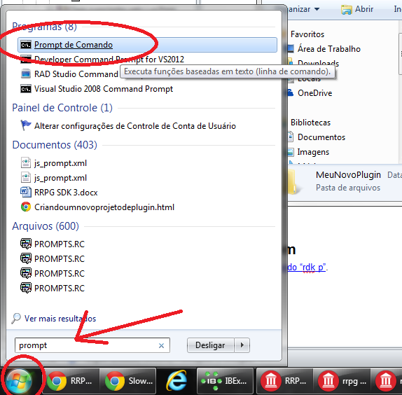
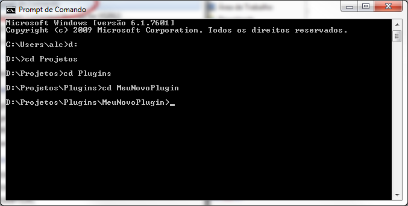
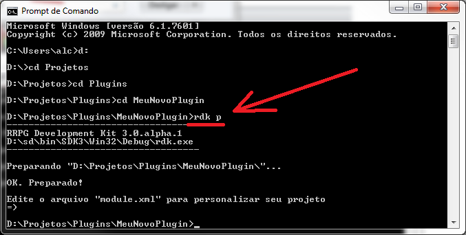
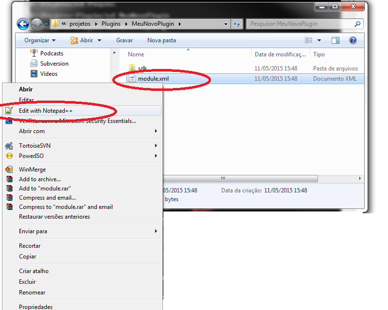
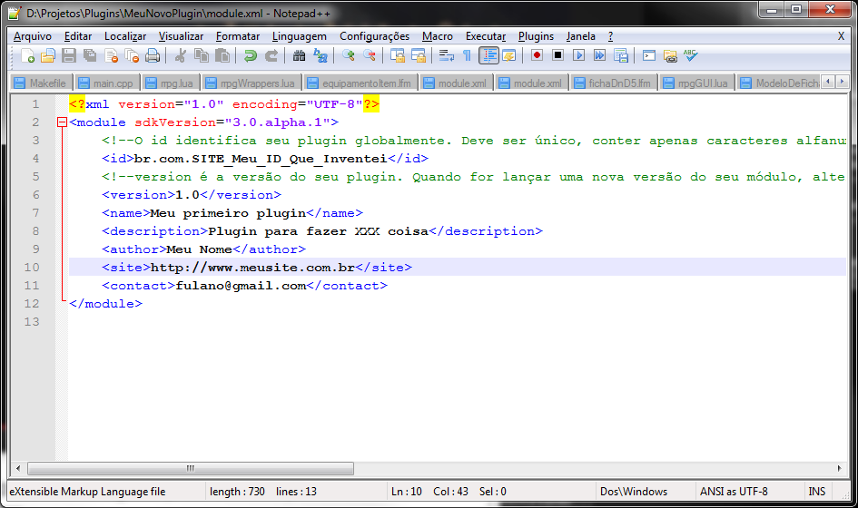

# Criando um projeto de plug-in

1. Crie uma nova pasta qualquer no computador.
1. Abra o prompt de comando e navegue pelo prompt até a pasta criada.
1. Execute o comando “rdk p”, sem as aspas, dentro da pasta para transformar o diretório em um projeto de plug-in.
1. Vá até a pasta criada, abra, em um editor de texto, o arquivo “module.xml” que foi criado pelo comando acima e o preencha . Saiba mais sobre este arquivo lendo [O arquivo “module.xml”](Oarquivomodulexml.md)

# Exemplo passo a passo
   1. Criando uma nova pasta no computador:

   1. Abrindo o prompt de comando e navegando até a pasta criada...

   1. Executando o comando "rdk p"

   1. Editando o arquivo "module.xml":

# Veja também
  * [Comando “rdk p”](comandordkp.md).